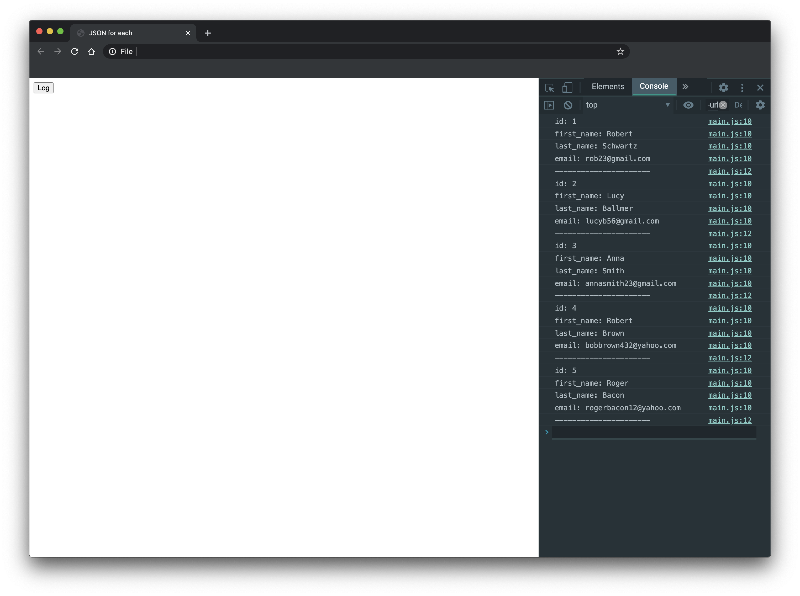

# Looping over JSON array in JavaScript

**JSON** `forEach` tutorial shows how to loop over a **JSON array** in **JavaScript**. In this tutorial we use **JSON server** to handle test data.

 
The `json-server` is a JavaScript library to create testing **REST API**.

First, we create a project directory an install the `json-server` module.

`$ mkdir jsonforeach`

`$ cd jsonforeach`

`$ npm init -y`

`$ npm i -g json-server`

The JSON server module is installed globally with npm.

## JSON test data

We have some JSON test data:

`users.json`

```json
{
  "users": [
    {
      "id": 1,
      "first_name": "Robert",
      "last_name": "Schwartz",
      "email": "rob23@gmail.com"
    },
    {
      "id": 2,
      "first_name": "Lucy",
      "last_name": "Ballmer",
      "email": "lucyb56@gmail.com"
    },
    {
      "id": 3,
      "first_name": "Anna",
      "last_name": "Smith",
      "email": "annasmith23@gmail.com"
    },
    {
      "id": 4,
      "first_name": "Robert",
      "last_name": "Brown",
      "email": "bobbrown432@yahoo.com"
    },
    {
      "id": 5,
      "first_name": "Roger",
      "last_name": "Bacon",
      "email": "rogerbacon12@yahoo.com"
    }
  ]
}
```

`$ json-server --watch users.json`

The `--watch` command is used to specify the data for the server.


`$ curl localhost:3000/users/3/`

```json
{
  "id": 3,
  "first_name": "Anna",
  "last_name": "Smith",
  "email": "annasmith23@gmail.com"
}
```

With the `curl` command, we get the user with Id 3.

## JSON forEach example

In the next example we retrieve data with a **GET** request using **fetch API**. We loop over the returned data with `forEach`.

`index.html`

```html
<!DOCTYPE html>
<html lang="en">

<head>
    <meta charset="UTF-8">
    <meta name="viewport" content="width=device-width, initial-scale=1.0">
    <title>Home page</title>
</head>

<body>

    <button id="log">Log</button>

    <script src="main.js"></script>
</body>

</html>
```

This is the `index.html` page. By clicking on the `Log button`, we `fetch` the data from the **JSON** server test data and log it into the **browser console**.

`main.js`

```js
const logBtn = document.getElementById('log');
logBtn.addEventListener('click', fetchData);

async function fetchData() {

    const response = await fetch('http://localhost:3000/users/');
    const data = await response.json();

    data.forEach(obj => {
        Object.entries(obj).forEach(([key, value]) => {
            console.log(`${key} ${value}`);
        });
        console.log('-------------------');
    });
}
```

The `fetch()` function retrieves data as JSON array from the provided URL. With `forEach()`, we go through the array.

```js
Object.entries(obj).forEach(([key, value]) => {
    console.log(`${key} ${value}`);
});
```

We go over the entries of each object and print the key and the value to the **console**.


```markdown
id 1 main.js:12:13
first_name Robert main.js:12:13
last_name Schwartz main.js:12:13
email rob23@gmail.com main.js:12:13
------------------- main.js:14:9
id 2 main.js:12:13
first_name Lucy main.js:12:13
last_name Ballmer main.js:12:13
email lucyb56@gmail.com main.js:12:13
------------------- main.js:14:9
...
```



This is the output in the **browser console**.

In this tutorial, we have shown how to *iterate over a JSON array with* `forEach`.